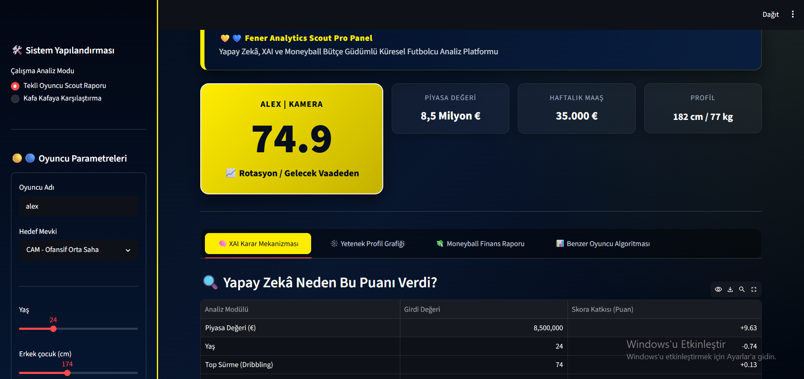
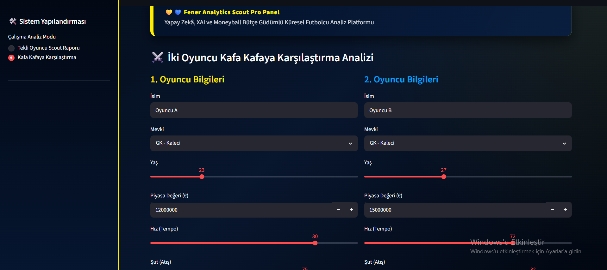
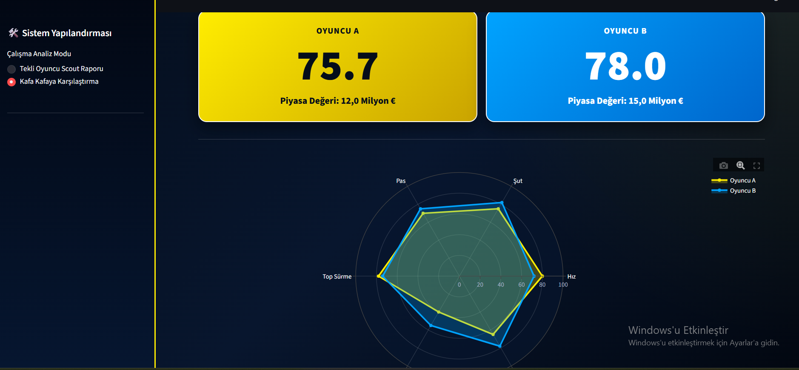

# ScoutIntel: Yapay Zekâ Tabanlı Futbolcu Performans ve Değer Optimizasyon Sistemi

## 1. Projenin Adı
ScoutIntel Pro Performance Suite (v1.0.0)

## 2. Problem Tanımı
Futbol endüstrisinde oyuncu transferleri ve maaş bütçelerinin yönetimi yüksek finansal riskler içermektedir. Geleneksel scout yöntemleri öznel gözlemlere dayandığı için hatalı transfer kararlarına yol açabilmektedir. Kulüplerin elindeki veri havuzları, teknik performans ile finansal değer arasındaki doğrusal olmayan karmaşık ilişkileri çözmekte ve geleceğe yönelik rasyonel tahminler üretmekte yetersiz kalmaktadır.

## 3. Hedef Kullanıcı
- Profesyonel futbol kulüplerinin scout (izleme) ekipleri
- Sportif direktörler ve kulüp yöneticileri
- Futbol veri analistleri

## 4. Çözümün Kısa Açıklaması
ScoutIntel; futbolcu veri kümelerini işleyen, makine öğrenmesi tabanlı bir karar destek platformudur. Sistem, girilen demografik, fiziksel ve teknik özellikleri (Hız, Şut, Pas, Top Sürme vb.) analiz ederek oyuncunun genel güç (Overall) skorunu tahmin eder. Moneyball algoritmasıyla oyuncunun hak ettiği tahmini piyasa maaşını hesaplar, bütçe uyumunu raporlar ve girilen özelliklere en benzer 3 gerçek oyuncuyu listeler. Ayrıca simülasyon verilerini tek tıkla PDF scout raporu olarak yerel bilgisayara indirir.

## 5. Kullanılan Teknolojiler
- Programlama Dili: Python 3.10+
- Kütüphaneler ve Algoritmalar: XGBoost Regressor, Scikit-Learn, SHAP (Explainer)
- Grafik ve Raporlama: Plotly, ReportLab (PDF)
- Kullanıcı Arayüzü: Streamlit Framework

## 6. Sistem Mimarisi veya İş Akışı
1. Veri Ön İşleme Hattı (data_preprocessing.py): FIFA 21 ve FIFA 22 veri kümeleri dikey olarak birleştirilir. Eksik veriler medyan yöntemiyle tamamlanır ve kategorik veriler One-Hot Encoding ile sayısallaştırılır.
2. Model Eğitim Hattı (train_model.py): Hazırlanan veri havuzu üzerinden Random Forest ve XGBoost modelleri eğitilir. En yüksek başarıyı veren XGBoost modeli best_football_model.pkl olarak kaydedilir.
3. Kullanıcı Arayüzü (app.py): Kullanıcı arayüzden özellikleri değiştirdiği an, girdi verileri dondurulmuş modele gönderilir; Plotly grafik motoru, SHAP tablosu ve PDF eklentisi tetiklenerek ekrana yansıtılır.

## 7. Kurulum Adımları
Uygulamayı yerel makinenizde başlatmak için terminalde sırasıyla aşağıdaki komutları çalıştırabilirsiniz:

Komut 1: git clone [https://github.com/imrandevran1907-coder/final-projesi-imran-devran.git](https://github.com/imrandevran1907-coder/final-projesi-imran-devran.git)

Komut 2: cd final-projesi-imran-devran

Komut 3: .\venv\Scripts\activate

Komut 4: pip install streamlit pandas numpy xgboost scikit-learn shap plotly reportlab

Komut 5: streamlit run app.py

## 8. Kullanım Biçimi
1. Uygulama açıldığında sol panelden oyuncu adı, mevkisi, yaş, boy, kilo, maaş ve bonservis girdilerini düzenleyin.
2. Teknik yetenek skorlarını (Hız, Şut, Pas vb.) kaydırgıçlar ile belirleyin ve "Detaylı Analiz Raporu Üret" butonuna basın.
3. Sağ panelde açılan sekmelerden tahmini genel puanı, SHAP net katkı tablosunu, Plotly radar grafiğini ve Moneyball bütçe analizini inceleyin.
4. Sayfa altındaki "RESMİ SCOUT RAPORUNU İNDİR (PDF)" butonuna tıklayarak kurumsal PDF çıktısını bilgisayarınıza kaydedin.

## 9. Örnek Ekran Görüntüleri

Görsel 1: Scout Raporu ve Genel Puan Sekmesi

Görsel 2: Açıklanabilir Yapay Zekâ (XAI) ve Radar Grafik Analizi

Görsel 3: Moneyball Bütçe Optimizasyonu ve PDF İndirme Butonu

## 10. Test Sonuçları
Model, veri havuzunun %20'lik izole test kümesi üzerinde test edilmiş ve şu sonuçlar elde edilmiştir:
- R² Başarı Skoru (Açıklayıcılık Oranı): %98.88
- Ortalama Mutlak Hata (MAE): 0.44 Puan (Model, oyuncuların gerçek güçlerini ortalama 0.44 puanlık sapmayla tahmin etmektedir.)

## 11. Bilinen Eksiklikler (Sistem Sınırları)
1. Taban Puan Sınırı (Floor Effect): Tüm yetenek skorları ve finansal değerler 0 girildiğinde, model eksi değerlere düşmemekte; algoritmik bir iç koruma çizgisi çekerek taban puanı 42.0 Overall seviyesinde sabitlemektedir.
2. Finansal Baskınlık Anomalisi: Oyuncunun teknik verileri ortalama seviyede tutulup, bonservis değeri uç seviyede yükseltildiğinde (Örn: 200M+ EUR), modelin teknik özellikleri göz ardı ederek paraya dayalı aşırı yüksek tahmin ürettiği saptanmıştır.